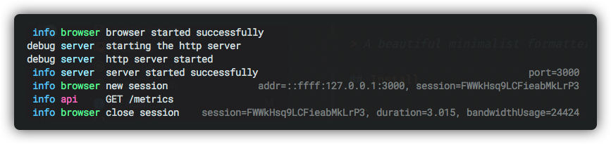

# pino-bravo 👏

[![npm version][1]][2]

> A beautiful minimalist formatter for pino.

<p align="center">
  
</p>

## Install

```sh
$ npm add pino pino-bravo
```

## Usage

```ts
import pino from 'pino'
import pinoBravo from 'pino-bravo'

const logger = pino({
  prettyPrint: true,
  prettifier: pinoBravo(/* options */)
})
```

## [Options](src/types.ts)

| Option          | Type                    | Default               | Description                                                                                                                                       |
| --------------- | ----------------------- | --------------------- | ------------------------------------------------------------------------------------------------------------------------------------------------- |
| `ignoreKeys`    | `string`                | `'hostname,pid,time'` | A comma-separated list of log keys to ignore.                                                                                                     |
| `modules`       | `Record<string, Style>` | `{}`                  | A map of modules _(eg. browser, api, ...)_ and their associated colors _(eg. green, magenta, ...)_. If omitted, colors are picked automatically.  |
| `modulePadding` | `number`                | `undefined`           | Modules padding for alignement. If omitted and `modules` is provided, it will infer the padding automatically. Otherwise it will not pad modules. |

[1]: https://img.shields.io/npm/v/pino-bravo.svg?style=flat-square
[2]: https://npmjs.org/package/pino-bravo
